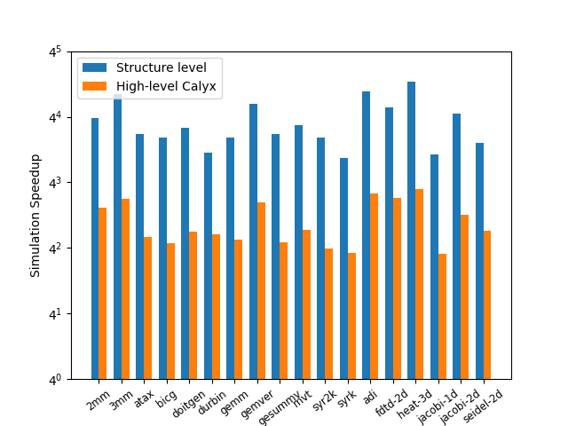

# Artifact Evaluation of Hestia

This repository contains the evaluation materials for our MICRO 2024 paper entitled "Hestia: An Efficient Cross-level Debugger for High-level Synthesis".

# Setup

## Install Rust

```bash
curl https://sh.rustup.rs -sSf | sh
```

## Build Hestia

```bash
git clone https://github.com/pku-liang/hestia.git
cargo build --all --release
```

## Error Encountered When Building Hestia

If you encounter the following error:
```bash
Error[E0658]: #[diagnostic] attribute name space is experimental
```

You can resolve this by installing and setting the nightly version of Rust:

```bash
rustup install nightly
rustup default nightly
```

# Cider Setup

## Install python dependencies

```bash
python3 -m pip install numpy flit prettytable wheel hypothesis pytest simplejson matplotlib scipy seaborn
```

## Build Calyx and Cider

```bash
git clone https://github.com/cucapra/calyx.git calyx
cd calyx
git checkout cider-eval # important !!!
cargo build --all --release
```

## Install Fud

```bash
cd calyx # go to the calyx directory from the prior step
cd fud
flit install --symlink # make sure this is in your path
```

Now you need to configure fud. Fill in `PATH/TO/CALYX`  with
the appropriate values for your installation

```bash
fud config global.futil_directory 'PATH/TO/CALYX' && \
fud config stages.futil.exec 'PATH/TO/CALYX/target/release/futil' && \
fud config stages.interpreter.exec 'PATH/TO/CALYX/target/release/interp' && \
fud register icarus-verilog -p 'PATH/TO/CALYX/fud/icarus/icarus.py' && \
fud config stages.interpreter.flags " --no-verify " # the spaces are important
```

# Evaluation data

Set the path of Hestia in `data.py`

```python
hestia = "~/hestia/target/release/hestia "
```

Use the python script to run the evaluation and to generate three csv files. (Table III, Table IV, Fig 8)

```bash
python3 data.py
```

# Generate figure

```bash
python3 figure.py
```

The generated figure `figure.png` looks like this:


# Interactive debugging with Hestia

## Case 1: (IAP in Section VII-C)

The work directory is `examples/case1`. First, invoke the software-level simulation:

```bash
hestia command.tcl
```

Run the simulation and inspect the result. You will find that the result differs from `data/D_out.txt`

```tcl
continue
mem op_3
exit
```

Re-run the simulation script `command.tcl` and debug through the breakpoint. 

```tcl
breakpoint op_116
continue
var op_115
```

 Unset the breakpoint and inspect address index through watchpoints at two loop variables and the address index. The erroneous address is finally exposed. (`show_op` prints the current operation at the software level)

```tcl
unset_breakpoint op_116
show_breakpoint
watch op_135_b
watch op_131_b
watch op_115
step 10000
show_op
step 2
```

## Case 2: (LIV in Section VII-C)

The work directory is `examples/case2`. First, invoke the schedule-level simulation:

```bash
hestia tor.tcl
```

Run the simulation and inspect the result. You will find that the result is the same as `data/C_out.txt`

After that, run the structure-level simulation. You will encounter a segmentation fault.

```bash
hestia hec_wrong.tcl
```

Then, run the cosimulation between schedule and structure level.
```bash
hestia cosim.tcl
```

You can get the co-simulation mismatch:
```bash
Value Mismatch: operation "op_44" and primitive "muli_main_0" at state @s14
```

Comment the line 6 and uncomment line 7 in `cosim.tcl`, you can pass the co-simulation.

## Case 3: (Optical Flow in Section VII-D)

The work directory is `examples/case3`. First, invoke the schedule-level simulation:

```bash
hestia tor.tcl
```

You can get the fault:
```bash
index out of bounds: the len is 1024 but the index is 1024
```

Here, we find an error in the open source implementation, which is caused by the line 44 of [Optical_flow](https://github.com/cornell-zhang/rosetta/blob/master/optical-flow/src/sdsoc/optical_flow.cpp)

```C++
void gradient_xy_calc(input_t frame[MAX_HEIGHT][MAX_WIDTH],
    pixel_t gradient_x[MAX_HEIGHT][MAX_WIDTH],
    pixel_t gradient_y[MAX_HEIGHT][MAX_WIDTH])
{
  static pixel_t buf[5][MAX_WIDTH];
  #pragma HLS array_partition variable=buf complete dim=1

  // small buffer
  pixel_t smallbuf[5];
  #pragma HLS array_partition variable=smallbuf complete dim=0

  GRAD_XY_OUTER: for(int r=0; r<MAX_HEIGHT+2; r++)
  {
    GRAD_XY_INNER: for(int c=0; c<MAX_WIDTH+2; c++)
    {
      #pragma HLS pipeline II=1
      // read out values from current line buffer
      for (int i = 0; i < 4; i ++ )
Line 44: smallbuf[i] = buf[i+1][c];
    }
  }
}
```